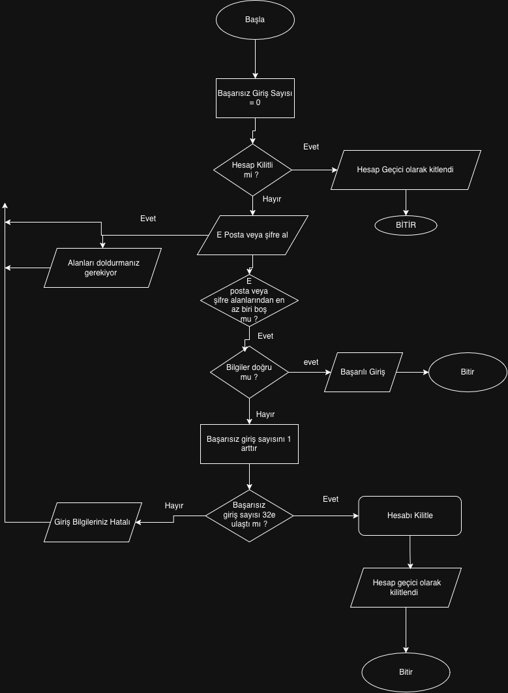

# Kullanıcı Giriş Akışı — Algoritma Diyagramı

## Projenin Amacı

Bu proje, bir kullanıcı giriş sürecinin algoritmasını ve akış diyagramını modellemek amacıyla hazırlanmıştır. Hesap kilitlenme durumu, boş giriş alanları, doğru ve yanlış girişler ile başarısız giriş sayısına bağlı hesap kilitleme işlemleri diyagram üzerinde gösterilmiştir.

## İş Kuralları

- Hesabın kilitli olup olmadığı kontrol edilir.
- Hesap kilitliyse giriş işlemi engellenir.
- E-posta veya şifre alanlarından biri boşsa uyarı gösterilir ve başarısız giriş sayısı artırılmaz.
- Doğru bilgiler girildiğinde başarılı giriş mesajı gösterilir.
- Yanlış bilgiler girildiğinde başarısız giriş sayısı 1 artırılır.
- Üç başarısız denemede hesap kilitlenir.
- Hesap kilitlendikten sonra yeni giriş denemeleri engellenir.

## Akış Diyagramı

## Test Senaryoları

| Senaryo | Beklenen sonuç |
|---|---|
| Hesap kilitli | Giriş engellenir ve kilit mesajı gösterilir |
| E-posta boş | Uyarı gösterilir, sayaç artmaz |
| Şifre boş | Uyarı gösterilir, sayaç artmaz |
| E-posta ve şifre doğru | Başarılı giriş gösterilir |
| Yanlış bilgi, sayaç 0 | Sayaç 1 olur ve hata gösterilir |
| Yanlış bilgi, sayaç 1 | Sayaç 2 olur ve hata gösterilir |
| Yanlış bilgi, sayaç 2 | Sayaç 3 olur ve hesap kilitlenir |
| Üç başarısız denemeden sonra yeni giriş | Hesap kilitli olduğu için giriş engellenir |

## Tasarım Kararları

Algoritmanın başlangıcında hesabın kilitli olup olmadığı kontrol edilir. Hesap kilitliyse kullanıcıdan giriş bilgileri alınmadan işlem sonlandırılır.

Başarısız giriş sayısı başlangıçta 0 olarak belirlenir. E-posta veya şifre alanlarından biri boş olduğunda kullanıcıya uyarı gösterilir ve bu durum başarısız giriş olarak değerlendirilmez.

Kullanıcı yanlış bilgiler girdiğinde başarısız giriş sayısı 1 artırılır. Sayaç 3'e ulaştığında hesap kilitlenir ve kullanıcıya kilitlenme mesajı gösterilir. Sayaç 3'e ulaşmadıysa kullanıcıya hatalı giriş mesajı gösterilerek yeni giriş yapması sağlanır.

## Öğrenci Bilgisi

- Ad Soyad: Ramazan Kepelek
- Ödev: Algoritma Tasarımı ve Akış Diyagramı
